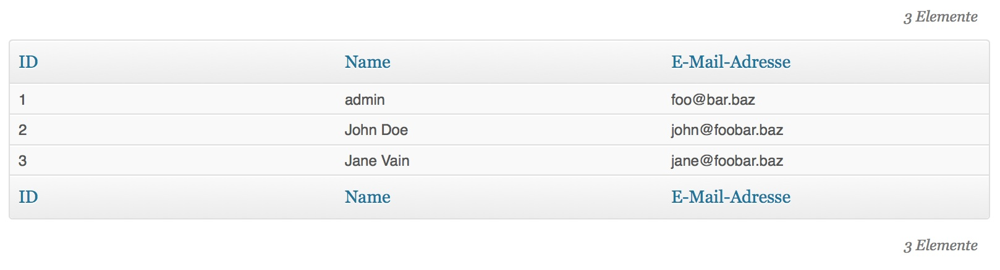

wp-easy-admin-table
===================

Simplified usage of tables in wordpress plugin admin views.


## Usage

Include the class file and instantiate a new `EasyAdminTable($data, $per_page)` with a two-dimensional array as parameter; The second parameter is for pagination and defaults to 30 items per page.

### Examples

The array structure should be like in this example:

```
<?php
include_once("easy-admin-table.class.php");

$dogs = array(
	array("name"=>"Fido", "age"=>4, "color"=>"brown"),
	array("name"=>"Rex", "age"=>6, "color"=>"black"),
	array("name"=>"Snoopy", "age"=>2, "color"=>"white"),
	array("name"=>"Lassie", "age"=>5, "color"=>"golden"),
);

new EasyAdminTable($dogs);
```


A better example with dynamic data from the database:


```
<?php
include_once("easy-admin-table.class.php");

global $wpdb;
$sql = 'SELECT ID, user_login as name, user_email as email FROM '.$wpdb->base_prefix.'users';
$users = $wpdb->get_results( $sql, ARRAY_A );

new EasyAdminTable($users);
```

will render like this:

